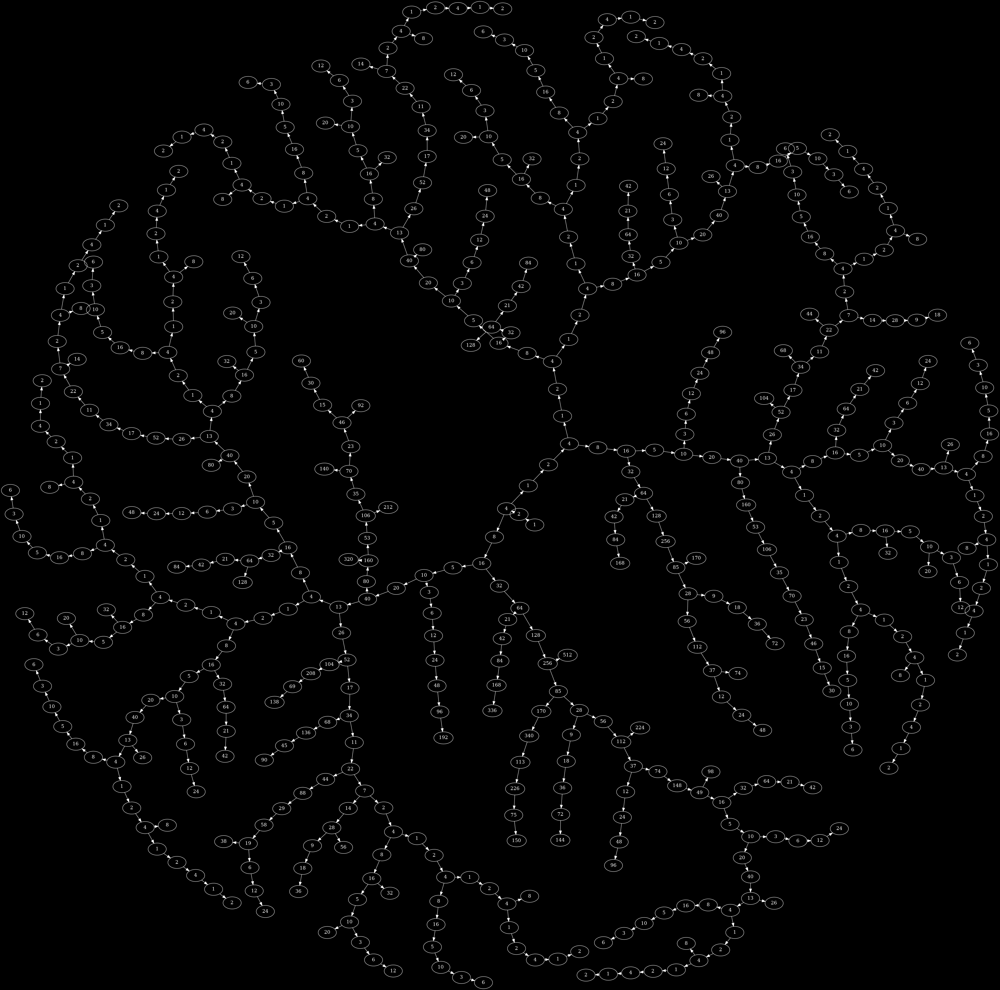

# collatz-stopping-time
A case study on memoization, compression and multithreaded sync primitives in C++.
The program computes the [maximum stopping time](https://en.wikipedia.org/wiki/Collatz_conjecture#Stopping_times) of all integers below 1'000'000'000.  
The main goal of this small project is to study various optimizations to reduce the runtime of the algorithm.  
See the source code and the comments.

## Extra

A small program to render a limited collatz tree to a dot file.
Here is the dot file rendered using graphviz's force-directed layout algorithm.

